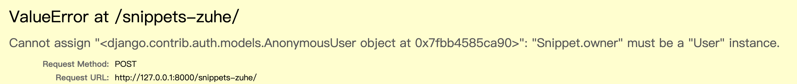

**创建时添加创建者**

```
def perform_create(self, serializer): # 针对哪一个序列化器的对象我要执行,创建的方法
```

* drf 提供的钩子函数
* 创建时候添加owner
* 
* 匿名用户不能为snippets 提供 owner 字段


**关联一对多**

```
class UserModelSerializer(serializers.ModelSerializer):
    snippets = serializers.PrimaryKeyRelatedField(many=True, queryset=Snippet.objects.all())
```

* 用户序列化器 包含多个snippets 


**序列化器返回用户**

```
class SnippetModelSerializer(serializers.ModelSerializer):
    owner = serializers.ReadOnlyField(source='owner.username')

```

* 获取snippet 的用户并返回其用户名
* source 表示这个字段来自owner.username

