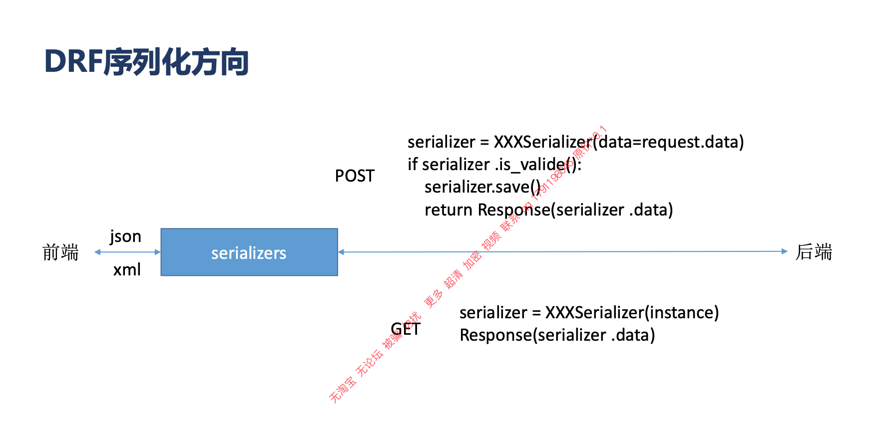

# 4. drf 系统组成和工作机制

**01.课程讲义pdf和源代码.pdf**

* 序列化, 视图
* 路由器, 认证, 权限, 验证, 过滤
* 解析器, 渲染器, 分页, 限流, 测试
* 概要(Schema),  异常, 配置, 状态码
* 版本, 内容协商, 缓存, 元数据

### 运行机制

**正向**

* client
* url
* Router
  * 把请求Request 转发到视图
  * 对请求做封装
* 视图
  * 拿到请求, 解析器解析请求内容
  * 根据请求内容向后台进行操作
* 序列化器
  * 反序列化  成 model模型, 
* 通过ORM 存储到数据库

**反向**

* 数据库
* 通过ORM 拿出QuerySet
* 通过序列化器, 序列化一下, 变成能够传输的json数据
* 通过render渲染器,渲染成一个报文,
* 通过response 响应到路由, 通过路由响应到前端

* **相比django, DRF 对Request 和 Response 进行了封装**

* 视图在解析请求数据时, drf有各种解析器. django 只是html form 表单 格式解析
* 返回响应时候, 可以通过render 渲染不同的数据
* 在视图层, 模型层之间添加了一个序列化器层

### 序列化器

**序列化器做什么**

* 序列化器就是将json 无法处理的原生model数据, 转化为可以 处理的json格式

**序列化器是如何做到的?**

* django.core.serializers 提供的弱一些
* drf 的serializers 更强大,  可选方式更多
* https://www.liujiangblog.com/course/django/171
  * 转化为xml格式

**get过程**

前端get请求要访问后端, 把后端通过orm 获取的 instance 用某某序列化器进行序列化, 然后把序列化.data作为响应内容,  返回给前端, json, 也可以xml

**post过程**

通过request.data获取POST数据, 通过序列化器, 合法性验证, 保存save(), 返回响应

​	

