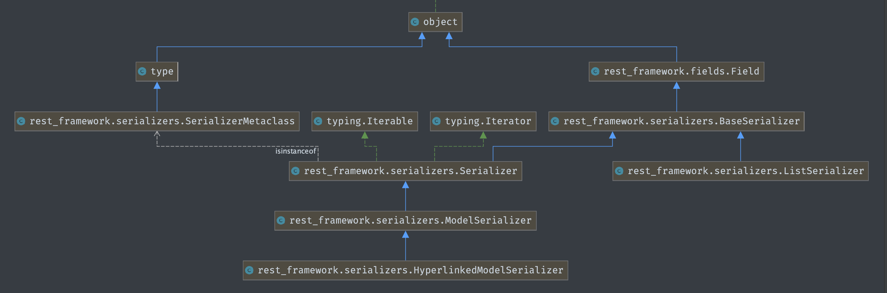

# 5. 编写序列化类

**新建应用 snippets**

pygments 代码高亮

* 准备工作, 
* 创建模型


**编写模型层**


**编写序列化器**

* 将 model queryset 和 json 之间进行序列化和反序列化

 





drf 的序列化类, 非常类似, django 的form model


序列化器不需要序列化模型所有字段, 是可选的.	


# 6 序列化器 基本使用

**create()**


**update()**

* validated_data 经过验证的数据 字典格式
* 将里面的参数赋值给instance

* 


````
➜ python manage.py shell
Python 3.8.6 (v3.8.6:db455296be, Sep 23 2020, 13:31:39) 
[Clang 6.0 (clang-600.0.57)] on darwin
Type "help", "copyright", "credits" or "license" for more information.

>>> from snippets.models import Snippet
>>> from snippets.serializers import SnippetSerializer
>>> from snippets.serializers import SnippetSerializer
>>> from rest_framework.renderers import JSONRenderer
>>> from  rest_framework.parsers import JSONParser  
# 导入序渲染器, 解析器

>>> snippet = Snippet(code='foo = "far"\n')
>>> snippet.save()
>>> snippet = Snippet(code='print("hello world")')
>>> snippet.save()

>>> serializer = SnippetSerializer(snippet)

# serializer 有一个属性  包含了序列化出来的数据

>>> serializer.data
{'id': 2, 'title': '', 'code': 'print("hello world")', 'linenos': False, 'language': 'Python', 'style': 'friendly'}


>>> type(serializer)
<class 'snippets.serializers.SnippetSerializer'>

>>> type(serializer.data)
<class 'rest_framework.utils.serializer_helpers.ReturnDict'>

# serializer.data 是 `ReturnDict` 类型  是`dict`子类
>>> issubclass(type(serializer.data), dict)
True


通过渲染器将字典类型转化成json 格式

>>> content = JSONRenderer().render(serializer.data)
>>> content
b'{"id":2,"title":"","code":"print(\\"hello world\\")","linenos":false,"language":"Python","style":"friendly"}'


转换成yaml格式
>>> from rest_framework.renderers import OpenAPIRenderer
>>> content = OpenAPIRenderer().render(serializer.data)
>>> content
b'!!python/object/apply:builtins.dict\n- id: 2\n  title: \'\'\n  code: print("hello world")\n  linenos: false\n  language: Python\n  style: friendly\n'

!!python/object/apply:builtins.dict
- id: 2
  title: ''
  code: print("hello world")
  linenos: false
  language: Python
  style: friendly


````

**正向序列化**

* render 渲染的意思 +er 就是渲染器 renderer
* serializer.data 是 `ReturnDict` 类型  是`dict`子类
* 将字典类型转化成json 格式


**分析器分析数据流**

```
>>> import io
>>> stream = io.BytesIO(content)
>>> data = JSONParser().parse(stream)
>>> data
{'id': 2, 'title': '', 'code': 'print("hello world")', 'linenos': False, 'language': 'python', 'style': 'friendly'}

>>> type(data)
<class 'dict'>

```

* 

**反向序列化**

```

>>> serializer = SnippetSerializer(data=data)
>>> serializer.is_valid()
True

>>> serializer.validated_data
OrderedDict([('title', ''), ('code', 'print("hello world")'), ('linenos', False), ('language', 'python'), ('style', 'friendly')])

>>> serializer.save()
<Snippet: Snippet object (7)>

```

* 转变成queryset


**查询多个对象时 要提供many=True**

```
>>> s = SnippetSerializer(Snippet.objects.all(), many=True)
>>> s.data
[OrderedDict([('id', 3), ('title', ''), ('code', 'foo = "far"\n'), ('linenos', False), ('language', 'Python'), ('style', 'friendly')]), OrderedDict([('id', 4), ('title', ''), ('code', 'print("hello world")'), ('linenos', False), ('language', 'Python'), ('style', 'friendly')]), OrderedDict([('id', 5), ('title', ''), ('code', 'foo = "far"\n'), ('linenos', False), ('language', 'python'), ('style', 'friendly')]), OrderedDict([('id', 6), ('title', ''), ('code', 'print("hello world")'), ('linenos', False), ('language', 'python'), ('style', 'friendly')]), OrderedDict([('id', 7), ('title', ''), ('code', 'print("hello world")'), ('linenos', False), ('language', 'python'), ('style', 'friendly')])]

```


 


