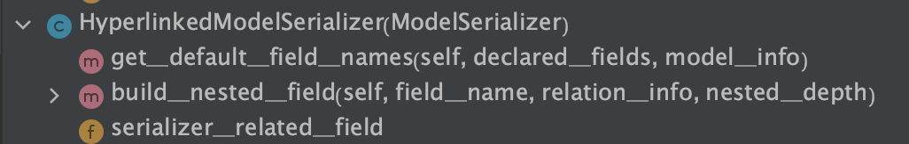
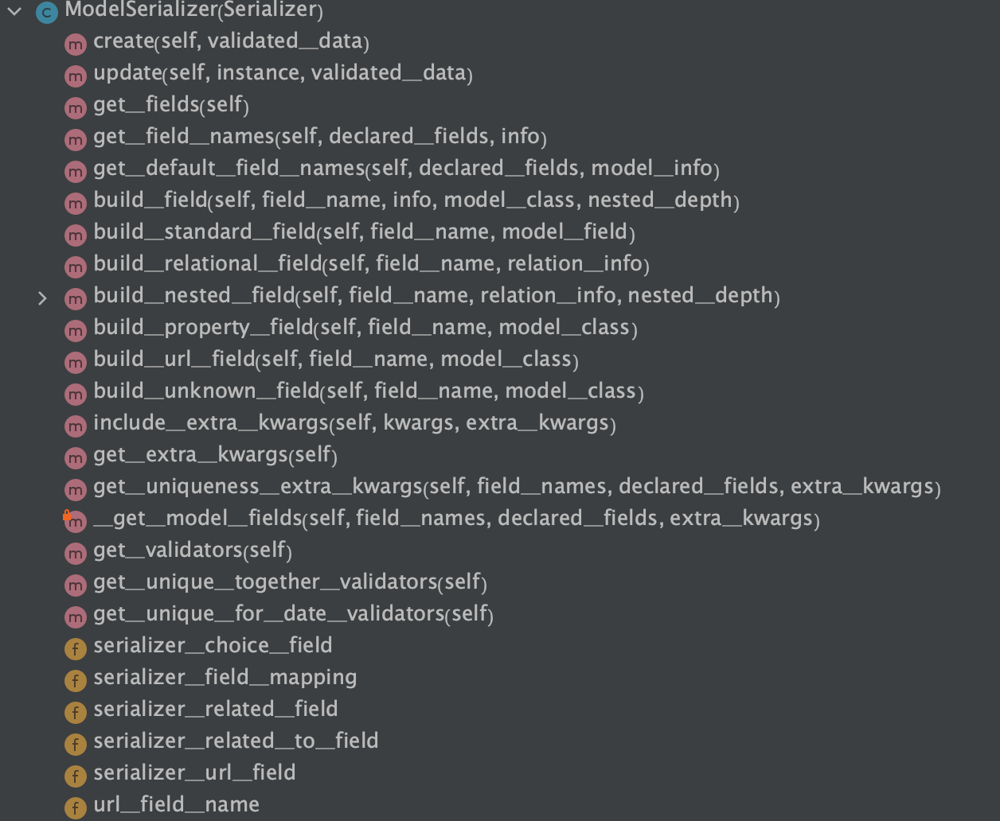
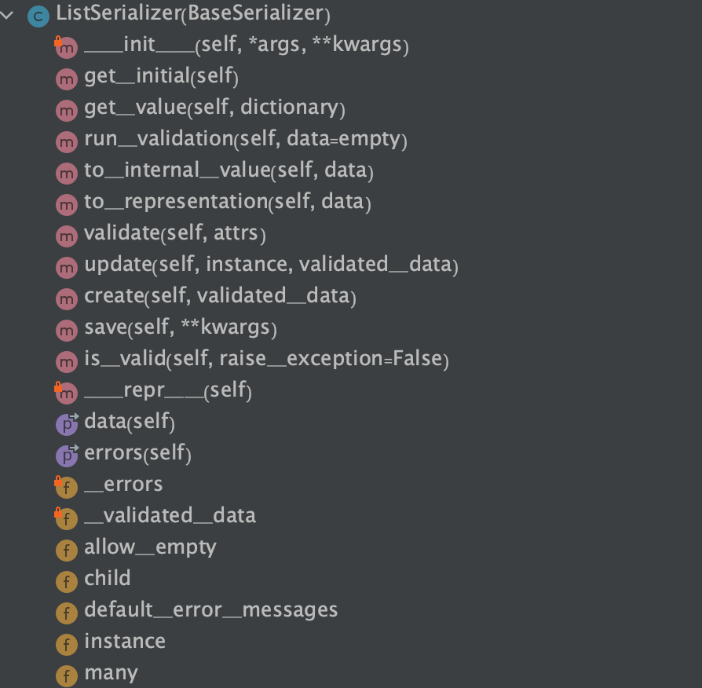
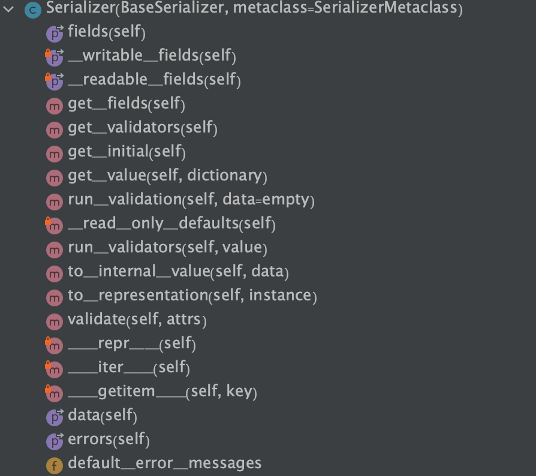
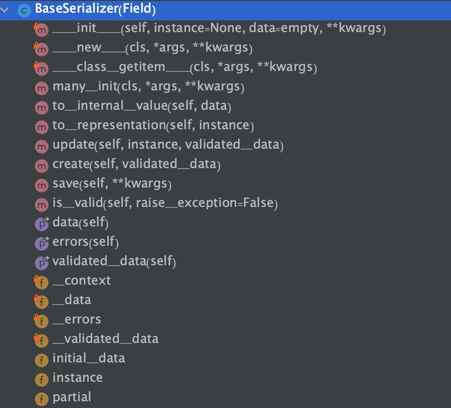

# 7. 编写视图 和url

**ModelSerializer**

```
指定模型
指定字段
modelSerializer 为我们提供了 create, update 方法
```

* 降低了可定制型

















**视图**

* `snippet_list()`


```
JsonResponse(serializer.data, safe=False
```

* 当safe=True并且所传过来的data不是dict类型时，会引发异常，提醒我们如果传过来的objects不是dict，就将safe参数设置为False.


* list 方法  get post

* 详情方法  get put delete


