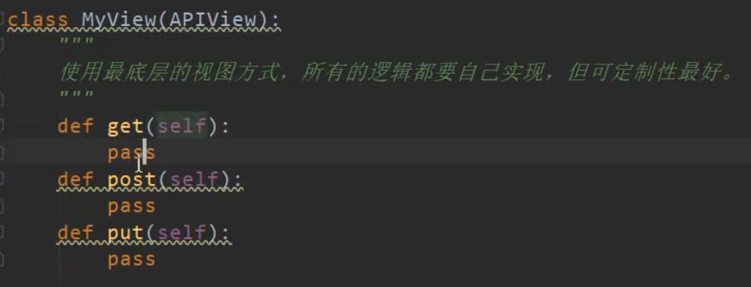
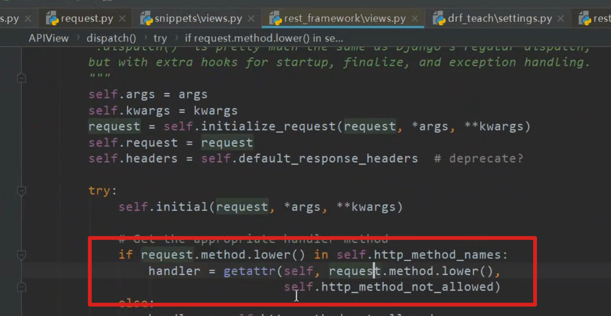

# DRF核心APIView运行流程和源码解读

**APIView**

* 继承View

* **as_view()** 入口 实现请求分发

* 继承了APIView 就会赋值一些变量从 settings 中

  

**as_view()**

**调用View的as_view()**

* 调用APIView的**dispatch()** 方法
* 返回view()给drf的as_view()中的view变量

**dispatch()** 先执行自己的, **自己没有再去父类找**

**initialize_request()**

* 获取解析器上下文  get_parser_context()
* 获取解析器,  get_parsers()  从  DEFAULT_PARSER_CLASSES 获取列表遍历, 并实例化
* 获取认证器 get_authenticators() 从 DEFAULT_AUTHENTICATION_CLASSES 获取列表遍历, 并实例化
* 获取内容协商  get_content_negotiator()  从 DEFAULT_CONTENT_NEGOTIATION_CLASS  获取列表遍历, 并实例化

* 创建Request对象, 并把以上作为参数赋值给request.parsers实例变量. 
* 返回Request对象

**initial()**

* 获取后缀	
* 执行内容协商并在请求上存储接受的信息 perform_content_negotiation() 
  * get_renderers() 获取渲染器
  * get_content_negotiator() 获取内容协商
  * 通过内容协商, 以及后缀格式, 选择渲染器 select_renderer()
* 放在request.accepted_renderer  和 request.accepted_media_type中
* 确定API版本（如果正在使用版本控制）determine_version()
* 确保允许传入请求,检查 认证, 权限, 限流
  * perform_authentication()  执行Request 里的属性 user
    * 执行 _authenticate() 方法
      * 遍历每一个认证器 执行认证方法
  * check_permissions()
  * check_throttles()

**执行 与View dispath 相同的逻辑**

* 获取处理请求方法, 
  * 例如来的是get 请求, 映射到get方法中执行
* 将请求执行函数结果放到response 中

**finalize_response()**

* 检查处理,
* 保存到self.response 中

如果我们实现了继承APIView那么

* 对应的http方法要自己实现
* 如果不实现找不到处理方法 handler

