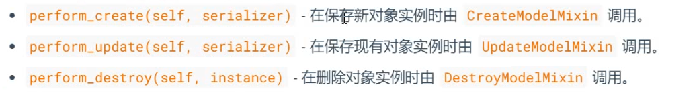

# 5. GenericAPIView 源码分析

**如何继承genericAPIView开发视图?**


```
所有其他通用视图的基类。
您需要设置这些属性，或者重写 get_queryset（）/ get_serializer_class（）

如果要覆盖视图方法，则必须调用get_queryset（）而不是直接访问queryset属性，

这一点很重要，

因为queryset只会被评估一次，并且所有后续请求的结果都将被缓存。
```


* allow_methods 允许的方法
* as_view
* authentication_classes
* check_object_permissions
* check_permissions
* check_throttles
* content_negotiation_class
* default_response_headers  默认响应
*  determine_version  决定的版本头  版本控制
* dispatch
* filter_backends 过滤后端
* filter_queryset  
* 获取认证头部
* 获取认证器
* 获取内容协商
* 获取异常处理
* 获取异常处理上下文
* 获取后缀
* **get_object  重要**
* 获取分页的响应
* 获取解析器上下文
* 获取权限
* **get_queryset  获取查询集  重要**    
* get_renderer_context
* get_renderers 获取渲染器
* **get_serializer 获取序列化器 重要**
* get_serializer_context 获取上下文
* 获取限流器
* 获取视图描述
* 获取视图名字
* 处理异常
* http方法名
* http不允许方法名
* initial
* initialize_request
* **loopup_field  查询字段**
* **lookup_url_kwarg 查询url 参数**


get() 对应get请求


**get_queryset()**

* 钩子的意义,执行流程过程中, 随时可以往里面套自己的东西
* 


### 属性

**queryset** 

* 调用查询集使用queryset, 而是get_queryset()

**serializer_class**

* 正向反向,序列化类

* 通常使用get_serializer_class() , 作为一个空的钩子,让我们能重写他

* **作用:** 

* ```
    def get_serializer_class(self):
          if self.request.user.is_staff:
              return FullAccountSerializer
          return BasicAccountSerializer
  ```

* 如果管理员可以看见不同的序列化器呈现的字段

* 动态的选择序列化类的作用

* **动态更改序列化器的例子**


**get_object()**

* 返回用与detail视图的对象实例


**filter_queryset()**

* 给定一个queryset 使用某种过滤器后端进行过滤, 返回一个新的queryset





**perform_create(self, serializer)**

* 在保存新对象实例时由 CreateModelMixin调用

**perform_update(self, serializer)**

* 在保存现有对象实例时由UpdateModelMixin调用

**perform_destroy(self, serializer)**

* 在删除对象实例时由DestroyModelMixin调用


